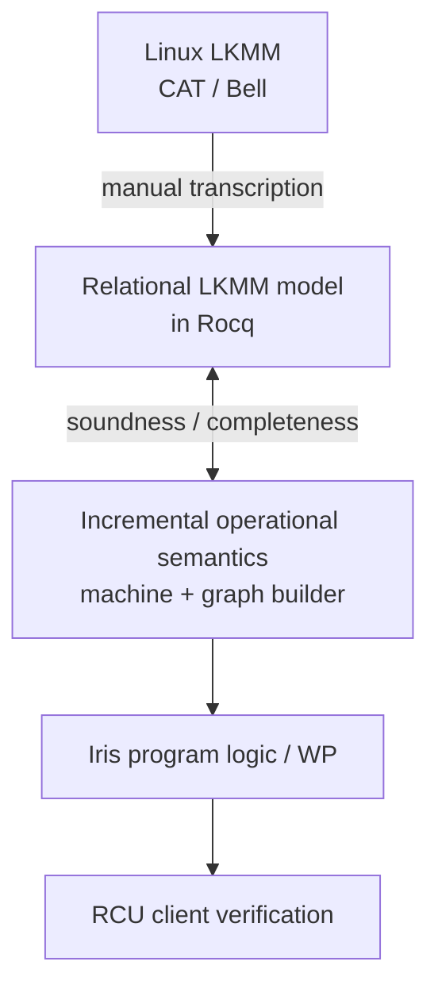

# IrisLKMM

IrisLKMM connects a mechanized fragment of the Linux Kernel Memory Model
(LKMM) to an operational semantics and an Iris program logic, proving
soundness/completeness of the operational model and adequacy of the logic,
including read-copy update (RCU) reclamation.



## Key results

- [x] Rocq model of the selected Linux v6.18 LKMM fragment
- [x] Incremental operational semantics with normal-RCU snapshot waiting
- [x] Operational soundness with respect to the Rocq LKMM model
- [x] Operational completeness up to event-ID renaming
- [x] Iris weakest-precondition logic with parallel composition
- [x] Iris adequacy for completed executions
- [x] Hoare-style message passing through shared-location protocols
- [x] RCU reclamation rule and a verified reader/updater WP example

## Main theorems

Read `lkmm_run P (initial_lkmm P) actions s` as: program `P` executes
from its initial state to state `s`, with action trace `actions`.
The execution graph extracted from `s` is `lkmm_candidate s`.

### Operational soundness

Every completed operational execution satisfying the explicit reads-from (`rf`)
and coherence (`co`) well-formedness obligations produces a candidate execution
of the program that is consistent with the Rocq LKMM model.

[`LkmmOperational.lkmm_run_soundness`](theories/operational/lkmm_operational.v):

```coq
Theorem lkmm_run_soundness P actions s :
  lkmm_run P (initial_lkmm P) actions s ->
  lkmm_complete s ->
  lkmm_program_graph_obligations s ->
  program_graph P (lkmm_candidate s) /\
  lkmm_consistent (lkmm_candidate s).
```

The `rf`/`co` obligations are completion-time premises; operational steps do
not invoke final-graph consistency.

### Operational completeness

Every finite, consistent candidate execution of an LKMM-Core program can be
generated by a completed operational execution, up to event-ID renaming.

[`LkmmOperational.lkmm_run_completeness`](theories/operational/lkmm_operational.v):

```coq
Theorem lkmm_run_completeness P G :
  program_graph P G ->
  lkmm_consistent G ->
  exists actions s f,
    lkmm_run P (initial_lkmm P) actions s /\
    lkmm_complete s /\
    lkmm_program_graph_obligations s /\
    candidate_renaming f G (lkmm_candidate s).
```

This establishes existence of a suitable schedule. It makes no progress
guarantee for other schedules. See the
[operational design](docs/semantics.md#operational-completeness).

### Iris adequacy and RCU reclamation

A closed Iris program proof establishes its pure trace and final-state
postcondition for every completed operational execution satisfying the `rf`/`co`
obligations. Initial resources are allocated from the program.

[`LkmmAdequacy.wp_adequacy`](theories/logic/adequacy.v):

```coq
Theorem wp_adequacy {Σ : gFunctors} `{!invGpreS Σ, !stateG Σ}
    P (Q : list lkmm_action -> lkmm_state -> Prop) :
  (forall `{!invGS Σ}, ⊢ completed_program_wp P Q) ->
  forall actions final,
    lkmm_run P (initial_lkmm P) actions final ->
    lkmm_complete final ->
    lkmm_program_graph_obligations final ->
    Q actions final.
```

The [message-passing example](theories/examples/message_passing_wp.v) proves
producer and consumer WPs using shared-location invariants and operation
receipts. Its closed proof and adequacy corollary establish that observing
the released flag through an acquire implies observing the published data.
The underlying LKMM ordering argument is encapsulated in library lemmas.
Its thread specifications use Iris's `{{{ Pre }}} body @ c; E
{{{ v, RET v; Post v }}}` notation; see the
[Hoare-triple interface](docs/wp-design.md#hoare-triple-notation).
The [whole-test triples](theories/tests/message_passing_hoare.v) specify all
four message-passing litmus variants and their final registers.
The three weaker variants have `{{{ Pre }}} P {{{ result, RET result;
Post result }}}?` specifications that prove an accepted completed execution
with `(1:r0=1, 1:r1=0)` exists. The same existential claim is refuted for
release/acquire using its existing Iris adequacy theorem; see
[existential triples](docs/wp-design.md#existential-execution-triples).

The [RCU reclamation rule](theories/logic/wp_rcu_client.v),
`wp_synchronize_reclaim`, recovers protected ownership after retirement and
completion of a grace period. The
[reader/updater example](theories/examples/rcu_client_examples.v) proves that
an admitted reader can access protected memory and return its loan before
unlocking, while the updater recovers full ownership after synchronization.
The caller supplies the reader's admission and matching unlock facts.

Adequacy currently establishes partial correctness of completed executions.
Safety for arbitrary execution prefixes and an end-to-end RCU client safety
theorem from program initialization remain future work. See the
[WP design](docs/wp-design.md) for the proof interface and guarantees.

## Scope and trusted boundary

The fragment covers finite executions with `READ_ONCE`/`WRITE_ONCE`,
acquire/release accesses, memory fences, address/data/control dependencies,
relaxed and ordered RMWs including failed conditional RMWs, and normal RCU
with nested read-side sections. LKMM-Core uses fixed agents and loop-free
structured programs. The relational model is independent of Iris.

The Linux v6.18 CAT/Bell definitions and operation mappings are manually
transcribed. Their correspondence to upstream remains trusted; completeness
also uses propositional excluded middle. Four message-passing outcome claims
are checked as Rocq proofs; see the
[litmus outcome validation](docs/litmus-outcomes.md). Builds and CI do not
run `herd7`, so these checks do not independently validate the upstream
correspondence. Independent transcription review, source-to-Core refinement,
and the `percpu_ref` case study remain future work. The kernel's RCU
implementation and grace-period liveness are outside the verification boundary.

See the [scope](docs/scope.md), [pinned model version](docs/model-version.md),
[CAT mapping](docs/cat-mapping.md), and
[trusted boundary](docs/trusted-boundary.md).

## Development setup

The project uses a repository-local opam switch. The checked-in lock file pins
the development baseline to OCaml 5.2.1, Rocq 9.1.0, stdpp 1.13.0, and Iris
4.5.0.

```sh
opam switch create . ocaml-base-compiler.5.2.1 --no-install
opam repository add rocq-released https://rocq-prover.org/opam/released --switch . --rank=2
opam repository add iris-dev git+https://gitlab.mpi-sws.org/iris/opam.git --switch . --rank=1
opam install . --deps-only --locked
make
```

Run commands through `opam exec -- ...`, or activate the switch in the current
shell with:

```sh
eval "$(opam env)"
```

Useful checks:

```sh
make check
opam list --locked
```

`make check` includes the message-passing outcome proofs. No `herd7`
installation or execution is required. The [model version](docs/model-version.md)
records the pinned upstream sources.

The broad package constraint supports Rocq 9.0.x and 9.1.x. The lock file is
the reproducible, tested development configuration and should be updated
deliberately.
